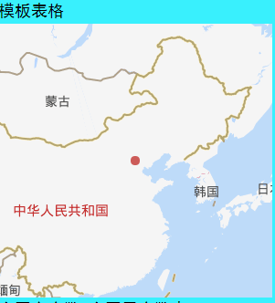

ECharts + Vue 折腾记
===
## 正文
### 开始 
1. 安装 `vue-cli`：`npm i vue-cli -g`
2. 初始化 Vue 项目：`vue init webpack`
3. 开启开发模式：`npm run dev`
4. 打开浏览器，查看网页： `http://localhost:8080`


**首先**，我们在项目中安装 ECharts 依赖：

```
npm i echarts -S
```

**然后**，你可以选择按需引用还是全局引用：

* **全局引用**

&emsp;ECharts 初始化应在钩子函数 `mounted()` 中，这个钩子函数是在 `el` 被新创建的 `vm.$el` 替换，并挂载到实例上去之后调用。

> 项目/src/main.js

```js
import Vue from 'vue'
import App from './App'
import router from './router'

// 引入echarts
import echarts from 'echarts'
Vue.prototype.$echarts = echarts

Vue.config.productionTip = false

new Vue({
  el: '#app',
  router,
  components: { App },
  template: '<App/>'
})
```

> 项目/src/components/HelloWorld.vue

```
<template>
  <div>
    <div id="myChart" :style="{width: '300px', height: '300px'}"></div>
  </div>
</template>

<script>
export default {
  name: 'hello',
  data () {
    return {
      msg: 'Welcome to Your Vue.js App'
    }
  },
  mounted(){
    this.drawLine();
  },
  methods: {
    drawLine(){
        // 基于准备好的dom，初始化echarts实例
        let myChart = this.$echarts.init(document.getElementById('myChart'))
        // 绘制图表
        myChart.setOption({
            title: { text: '在Vue中使用echarts' },
            tooltip: {},
            xAxis: {
                data: ["衬衫","羊毛衫","雪纺衫","裤子","高跟鞋","袜子"]
            },
            yAxis: {},
            series: [{
                name: '销量',
                type: 'bar',
                data: [5, 20, 36, 10, 10, 20]
            }]
        });
    }
  }
}
</script>

<style scoped>

</style>
```

* **按需引用**

如果我们使用全局引用。将 ECharts 图表打包，会导致体积过大，所以项目中最好按需引入。  

在这里我们使用 `requrie` 引用而不是 `import`，因为 `import` 必须写全路径，比较麻烦。

> 项目/src/components/HelloWorld.vue

```
<template>
  <div>
    <div id="myChart" :style="{width: '300px', height: '300px'}"></div>
  </div>
</template>

<script>
  // 引入基本模板
  let echarts = require("echarts/lib/echarts");
  // 引入柱状图组件
  require("echarts/lib/chart/bar");
  // 引入提示框和title组件
  require("echarts/lib/component/tooltip");
  require("echarts/lib/component/title");
  export default {
    name: 'hello',
    data() {
      return {
        msg: 'Welcome to Your Vue.js App'
      }
    },
    mounted() {
      this.drawLine();
    },
    methods: {
      drawLine() {
        // 基于准备好的dom，初始化echarts实例
        let myChart = echarts.init(document.getElementById('myChart'))
        // 绘制图表
        myChart.setOption({
          title: { text: 'ECharts 入门示例' },
          tooltip: {},
          xAxis: {
            data: ["衬衫", "羊毛衫", "雪纺衫", "裤子", "高跟鞋", "袜子"]
          },
          yAxis: {},
          series: [{
            name: '销量',
            type: 'bar',
            data: [5, 20, 36, 10, 10, 20]
          }]
        });
      }
    }
  };
</script>

<style scoped>

</style>
```

### ElementUI
考虑到项目没有 UI 设计稿。那么，就需要引用一款 Vue 的 UI 框架了，偷懒用 ElementUI 吧。  

然后，为了使项目尽可能小巧，**jsliang** 打算按需引入 ElementUI：

**步骤 1**. 安装 ElementUI：`npm i element-ui -S`

**步骤 2**. 安装 babel-plugin-component：`npm i babel-plugin-component -D`

**步骤 3**. 修改 .babelrc：

> .babelrc

```
{
  "presets": [
    ["env", {
      "modules": false,
      "targets": {
        "browsers": ["> 1%", "last 2 versions", "not ie <= 8"]
      }
    }],
    "stage-2"
  ],
  "plugins": [
    "transform-vue-jsx", 
    "transform-runtime",
    [
      "component",
      {
        "libraryName": "element-ui",
        "styleLibraryName": "theme-chalk"
      }
    ]
  ]
}
```

**步骤 4**. 按需引入 `Row` 与 `Col`：

> main.js

```js
import Vue from 'vue'
import App from './App'
import router from './router'

Vue.config.productionTip = false

import {Row, Col} from 'element-ui';
Vue.use(Row).use(Col);

new Vue({
  el: '#app',
  router,
  components: { App },
  template: '<App/>'
})
```

这样，就可以在项目中使用这两个组件了。

### 百度地图

引用百度地图很简单，但是结合 Vue + ECharts 来使用百度地图，很难。现在我们过一遍如何使用：

**步骤 1**. 引用百度地图：

> 项目/index.html

```html
<!DOCTYPE html>
<html>
  <head>
    <meta charset="utf-8">
    <meta name="viewport" content="width=device-width,initial-scale=1.0">
    <title>ECharts 图表</title>
    <script type="text/javascript" src="http://api.map.baidu.com/getscript?v=3.0&ak=Xjmh9v5jGa******6ZVf0PU2ueSedr5F"></script>
  </head>
  <body>
    <div id="app"></div>
  </body>
</html>
```

> 注意：srcipt 引用的链接，需要你去百度地图 API 那里获得，因为 ak 对应的是个人的 API 地址，这里不可能泄露给你的。[百度地图 API](http://lbsyun.baidu.com/index.php?title=jspopular3.0)

**步骤 2**. 在组件中使用它：

```
<template>
  <div class="temp">
    <p>模板表格</p>
    <div id="temp-chart" class="temp-chart"></div>
  </div>
</template>

<script>
// 注意在 index.html 引入全局的百度地图 JS
// script src=""http://api.map.baidu.com/getscript?v=3.0&ak=Xjmh9v5jGa******6ZVf0PU2ueSedr5F"

// 引入基本模板
let echarts = require("echarts/lib/echarts");

// 引入百度扩展
require("echarts/extension/bmap/bmap");

export default {
  name: "temp",
  data() {
    return {};
  },
  mounted() {
    this.drawTempMap();
  },
  methods: {
    drawTempMap() {
      // 基于准备好的dom，初始化echarts实例
      let myChart = echarts.init(document.getElementById("temp-chart"));

      // 创建地图实例
      var map = new BMap.Map("temp-chart");

      // 绘制图表
      myChart.setOption({
        // 加载 bmap 组件
        bmap: {
          // 百度地图中心经纬度
          center: [116.46, 39.92],
          // 百度地图缩放
          zoom: 4,
          // 是否开启拖拽缩放，可以只设置 'scale' 或者 'move'
          roam: true,
          // 百度地图的自定义样式，见 http://developer.baidu.com/map/jsdevelop-11.htm
          mapStyle: {}
        },
        series: [
          {
            type: "scatter",
            // 使用百度地图坐标系
            coordinateSystem: "bmap",
            // 数据格式跟在 geo 坐标系上一样，每一项都是 [经度，纬度，数值大小，其它维度...]
            data: [
              [116.46, 39.92, 1]
            ]
          }
        ]
      });
    }
  }
};
</script>

<style scoped>
.temp-chart {
  width: 300px;
  height: 300px;
}
</style>
```



这样，我们就可以在我们的 ECharts 畅通无阻地使用百度地图了。

## 精细入微

有时候，一些小细节总会困惑你。  

在这里，**jsliang** 将贴出自己解决的小细节。  

结合 `Ctrl + F` 搜索关键字喔~

### 百度地图调整

* **问**：为什么开发的时候控制台报 `warning`？  

```
api?v=3.0&ak=Xjmh9v5jGa*****6ZVf0PU2ueSedr5F:1 
A parser-blocking, 
cross site (i.e. different eTLD+1) script,
http://api.map.baidu.com/getscript?
```

* **答**：  

这时候你的引用地址应该是：

`<script type="text/javascript" src="http://api.map.baidu.com/api?v=3.0&ak=Xjmh9v5jGa******6ZVf0PU2ueSedr5F"></script>
`

你只需要将 `api` 改成 `getscript` 即可解决它的 `warning` 警告：

`<script type="text/javascript" src="http://api.map.baidu.com/getscript?v=3.0&ak=Xjmh9v5jGa******6ZVf0PU2ueSedr5F"></script>`

<hr>

* **问**：如何去除百度地图左下角的信息（logo 和 文字）？

* **答**：

&emsp;你只需要在全局样式里写上下面这段话就可以屏蔽它：

> App.vue

```
<style>
  .BMap_cpyCtrl, .BMap_noprint, .anchorBL {
    display: none !important;
  }
</style>
```

## 样式问题集

* **问**：为什么 Chrome 上的 `body` 会有 `8px` 的 `margin` 值？或者 `img` 不贴边之类的。

* **答**：

这是浏览器自带的样式喔，去掉方式：

首先，在项目的 `static` 目录上，新建 `css` 文件夹，然后新建 `reset.css`，内容如下所示：

> 项目/static/css/reset.css

```css
/* 
  * reset 的目的不是让默认样式在所有浏览器下一致，而是减少默认样式有可能带来的问题。
  * The purpose of reset is not to allow default styles to be consistent across all browsers, but to reduce the potential problems of default styles.
  * create by jsliang
*/

/** 清除内外边距 - clearance of inner and outer margins **/
body, h1, h2, h3, h4, h5, h6, hr, p, blockquote, /* 结构元素 - structural elements */
dl, dt, dd, ul, ol, li, /* 列表元素 - list elements */
pre, /* 文本格式元素 - text formatting elements */
form, fieldset, legend, button, input, textarea, /* 表单元素 - from elements */
th, td /* 表格元素 - table elements */ {
  margin: 0;
  padding: 0;
}

/** 设置默认字体 - setting the default font **/
body, button, input, select, textarea {
  font: 18px/1.5 '黑体', Helvetica, sans-serif;
}
h1, h2, h3, h4, h5, h6, button, input, select, textarea { font-size: 100%; }

/** 重置列表元素 - reset the list element **/
ul, ol { list-style: none; }

/** 重置文本格式元素 - reset the text format element **/
a, a:hover { text-decoration: none; }

/** 重置表单元素 - reset the form element **/
button { cursor: pointer; }
input { font-size: 18px; outline: none; }

/** 重置表格元素 - reset the table element **/
table { border-collapse: collapse; border-spacing: 0; }

/** 图片自适应 - image responsize **/
img { border: 0; display: inline-block; width: 100%; max-width: 100%; height: auto; vertical-align: middle; }

/* 
    * 默认box-sizing是content-box，该属性导致padding会撑大div，使用border-box可以解决该问题
    * set border-box for box-sizing when you use div, it solve the problem when you add padding and don't want to make the div width bigger
*/
div, input { box-sizing: border-box; }

/** 清除浮动 - clear float **/
.jsliang-clear:after, .clear:after {
  content: '\20';
  display: block;
  height: 0;
  clear: both;
}
.jsliang-clear, .clear {
  *zoom: 1;
}

/** 设置input的placeholder - set input placeholder **/
input::-webkit-input-placeholder { color: #919191; font-size: .26rem } /* Webkit browsers */
input::-moz-placeholder { color: #919191; font-size: .26rem } /* Mozilla Firefox */
input::-ms-input-placeholder { color: #919191; font-size: .26rem } /* Internet Explorer */
```

然后，在项目目录的 `src` 目录下的 `main.js` 文件中添加下面的语句，就可以引用 `css` 样式，清空浏览器的内置了：

> 项目/src/main.js

```js
import '../static/css/reset.css' /**引入样式重置 */
```

**Hello 小伙伴们，如果觉得本文还不错，记得点个赞或者给个 star，你们的赞和 star 是我编写更多更精彩文章的动力！[GitHub 地址](https://github.com/LiangJunrong/document-library)**

