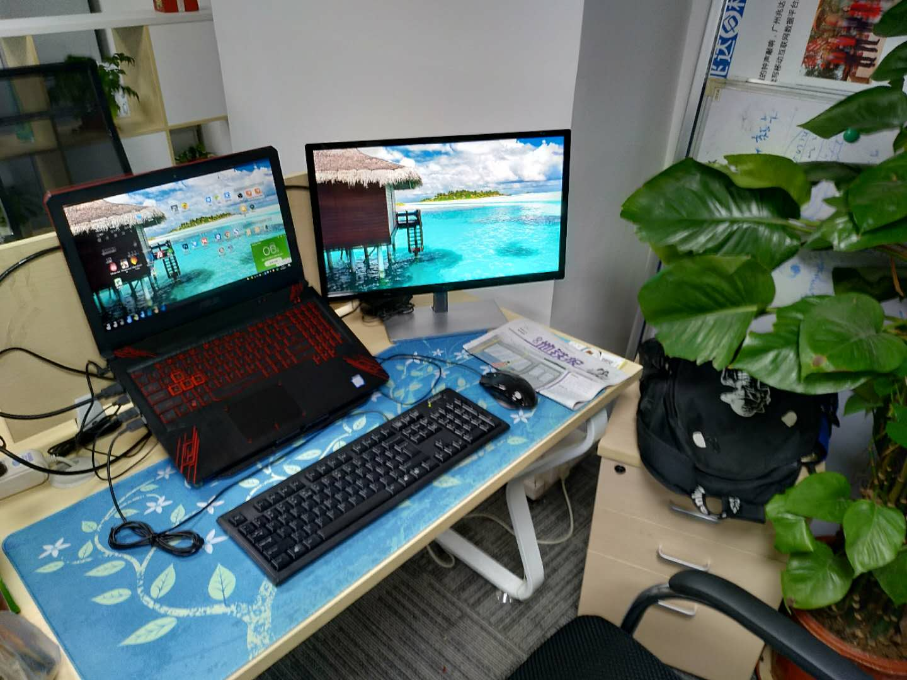
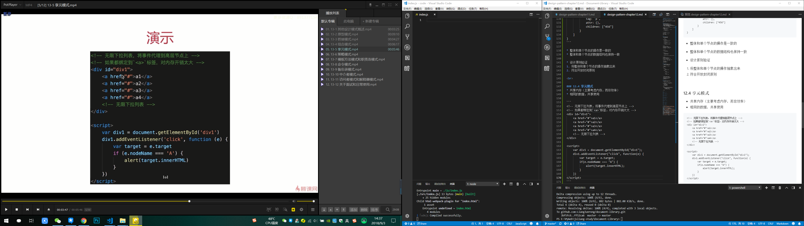

jsliang 的文档库
===

> 不折腾的前端，和咸鱼有什么区别！

## 一 最新

* 【推荐】[前端面试每日3+1](https://github.com/haizlin/fe-interview)，以面试题来驱动学习，坚持每天学习与思考，每天进步一点！

* **微信群**：（已满 100 人，需要先加 **jsliang** 微信，再拉你入群）

## 二 前言

如想知道 **jsliang** 最新学习进度，请前往 **[撰文思路](./other-library/Monologue/logs/README.md)** 进行查看。  

如想知道 **jsliang** 各种新奇玩意，请前往 **[网站清单](./other-library/Website/README.md)** 进行查看。

如想参与 **jsliang** 组织的小竞赛，请前往 **[个人竞赛](./other-library/Monologue/GitHub-competition.md)** 进行查看。

建文档库的初始目的：**记录一下 `jsliang` 在折腾学习某个黑科技的时候的操作笔记。**

因为，如果你学习而不写文章、不做笔记，某天你突发奇想，需要用到某个之前你用过的黑科技……那样的话，还需要 百度 / Google 一遍，太累了！太浪费人生了！

所以，集一生洪荒之力，写一个编程文档库，存放，我编程生涯的点点滴滴。

**不折腾的前端，跟咸鱼有什么区别！** 

## 三 文件目录

| 文件名             | 存放内容                           |
| ------------------ | --------------------------------  |
| [SUMMARY](./SUMMARY.md) | 目录                         |
| [news](./news.md) | 最新更新                         |
| [message-board](./message-board.md) | 留言板             |
| [friendship-links](./friendship-links.md) | 友情链接    |
| CSS-library        | CSS 文档仓库                       |
| HTML-library       | HTML 文档仓库                      |
| JavaScript-library | JavaScript 文档仓库                |
| other-library      | 其他文档仓库(整站制作/微信小程序)      |
| public-repertory   | 文档仓库使用到的图片、CSS 文件等……     |

## 四 个人网站

| 目录                                                   | 介绍                                       |
| ------------------------------------------------------ | ------------------------------------------ |
| [jsliang.top](http://jsliang.top/)                     | jsliang 的网站列表                         |
| [cv.jsliang.top](http://cv.jsliang.top/#/)             | 通过 ECharts + Vue 打造个人线上简历        |
| [playregex.jsliang.top](http://playregex.jsliang.top/) | 通过游戏来了解正则表达式                   |
| [lucky.jsliang.top](http://lucky.jsliang.top/)         | 悠闲刮刮乐，仅供娱乐                       |
| [deadline.jsliang.top](http://deadline.jsliang.top/)   | jsliang 的工作时间轴                       |
| [webpack.jsliang.top](http://webpack.jsliang.top/)     | Webpack 学习成果，Webpack 多页面配置       |
| [game.jsliang.top](http://game.jsliang.top/)           | 一个小游戏，只兼容 PC，适配移动端失败      |
| [company.jsliang.top](http://company.jsliang.top/)     | Node 打造企业网站，支持注册、登录及留言    |
| [work.jsliang.top](http://work.jsliang.top/)           | jsliang 工作成果，给领导或者工作小伙伴查看 |

## 五 推荐学习方法
  
建议小伙伴们有机会可以给自己配个显示器，也就 5/600 元，用起来也舒服。

**jsliang** 的开发配置为手提（Windows / 16G / 6核 / 12线程 / 7200RMB）+ 显示器 （21.5寸 / 1080P / 650RMB)。

对前端开发的来说，这个价还是用得起的，而且自己的配置，自己用得会比较舒服。

最后，祝小伙伴们在编程生涯中找到自己的节奏，工资步步高升。

> 办公场景

> 学习场景

